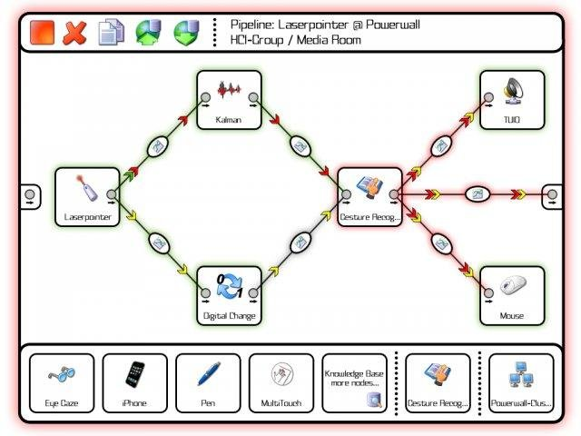
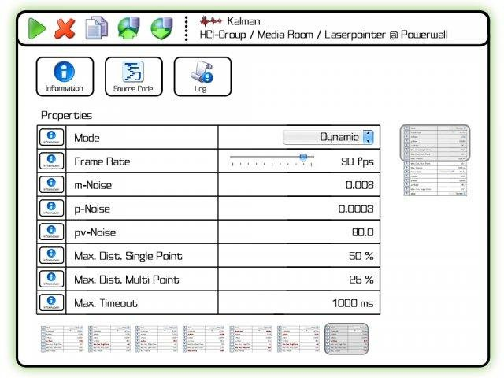
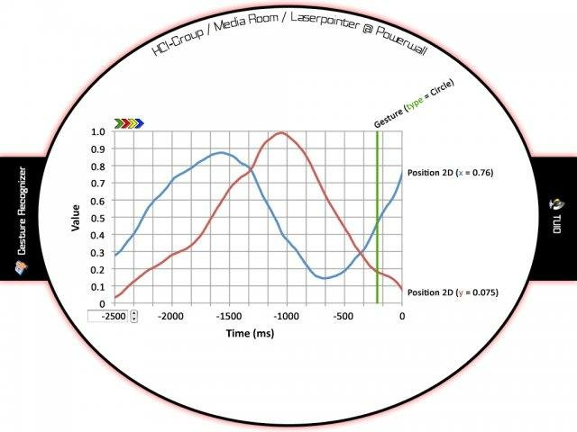

# Squidy IS A RESEARCH PROJECT #

Squidy is an open-source interaction library that unifies various device drivers and toolkits by integrating those in a homogeneous design environment. The project was initiated at the Human-Computer Interaction Group at the University of Konstanz and published under the LGPLv3 open-source license. Please consider that Squidy is a prototype and not mentioned to be a product. If you have any questions concerning Squidy, the source code, Squidy runtime, etc. feel free to contact the authors e.g. [Roman (dot) Raedle (at) uni-konstanz (dot) de]. We will try our best to help solving your problems.

### Video about Squidy ###

https://www.youtube.com/watch?v=_7Afy9cQNlA

Squidy UI Design:

### Pipeline View ###

### Properties View ###

### Description View ###

### Data Visualization View ###

### Source Code View ###

## BUILD and RUN ##

!!! The build does not work anymore since we had to shutdown our Maven package server !!! Use the binaries v. 1.1.0 for now.

To build a Squidy binary install Apache Maven and run the following command in Squidy checkout directory:

$> mvn package -Dmaven.test.skip=true -P assembly

Then run Squidy with the following command:

$> java -ms256m -mx1024m -jar squidy-nodes/target/squidy-nodes-1.5.0-SNAPSHOT-jar-with-dependencies.jar
